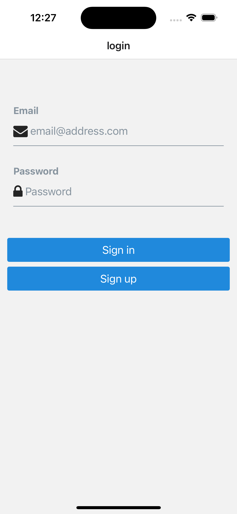
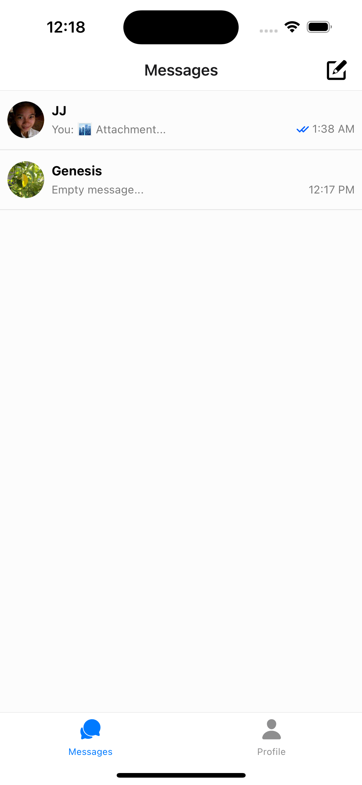
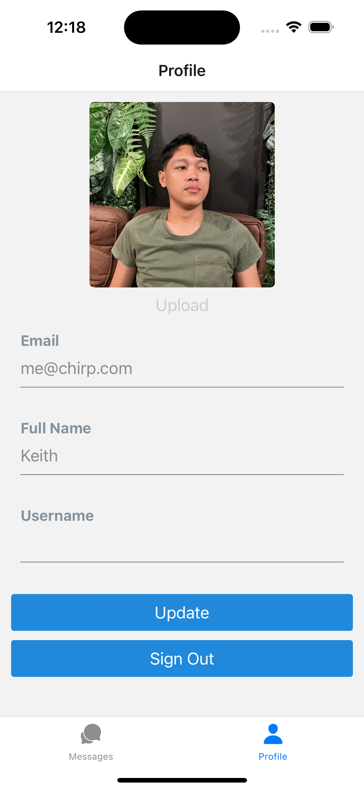
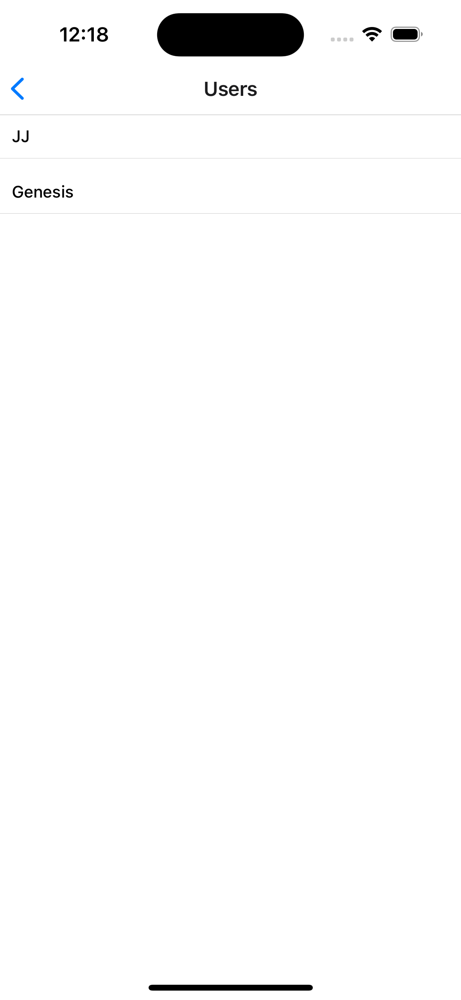
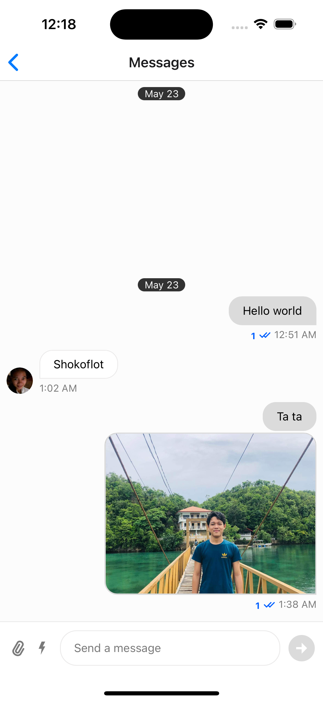

# Chirp

Chat app with clipboard, attachments, reactions and gif. Realtime online indicator on other users plus authentication.

## Tech Stack

**Client:** React Native Expo, React Context, Tanstack Query, Supabase, Stream Chat

**Server:** Supabase, Stream Chat

## Run Locally

Clone the project

```bash
  git clone <link to my repo >
```

Go to the project directory

```bash
  cd <my-project-name >
```

Install dependencies

```bash
  npm install
```

Start the server

```bash
  npm start
```

## Environment Variables

To run this project, you will need to add the following environment variables to your .env file for stream chat api endpoint if you want to use your own.

`EXPO_PUBLIC_STREAM_API_KEY`

`EXPO_PUBLIC_STREAM_SECRET`

`EXPO_PUBLIC_SUPABASE_URL`

`EXPO_PUBLIC_SUPABASE_ANON_KEY`

## Features

- Cross platform
- Real time updates with tanstack query
- Chat reactions, clipboard and attachments sharing.

## Screenshots

<div>





</div>

## Documentation for dependencies

- [Expo](https://docs.expo.dev/)
- [Stream Chat](https://getstream.io/chat/)
- [TanStack Query](https://tanstack.com/query/latest/docs/framework/react/overview)
- [Supabase](https://supabase.com/)

## Roadmap

- Add local storage for offline

- Add audio and video calls

## 🔗 Links

[](https://www.linkedin.com/in/bellkim-keith-onggon-0b6467140/)
